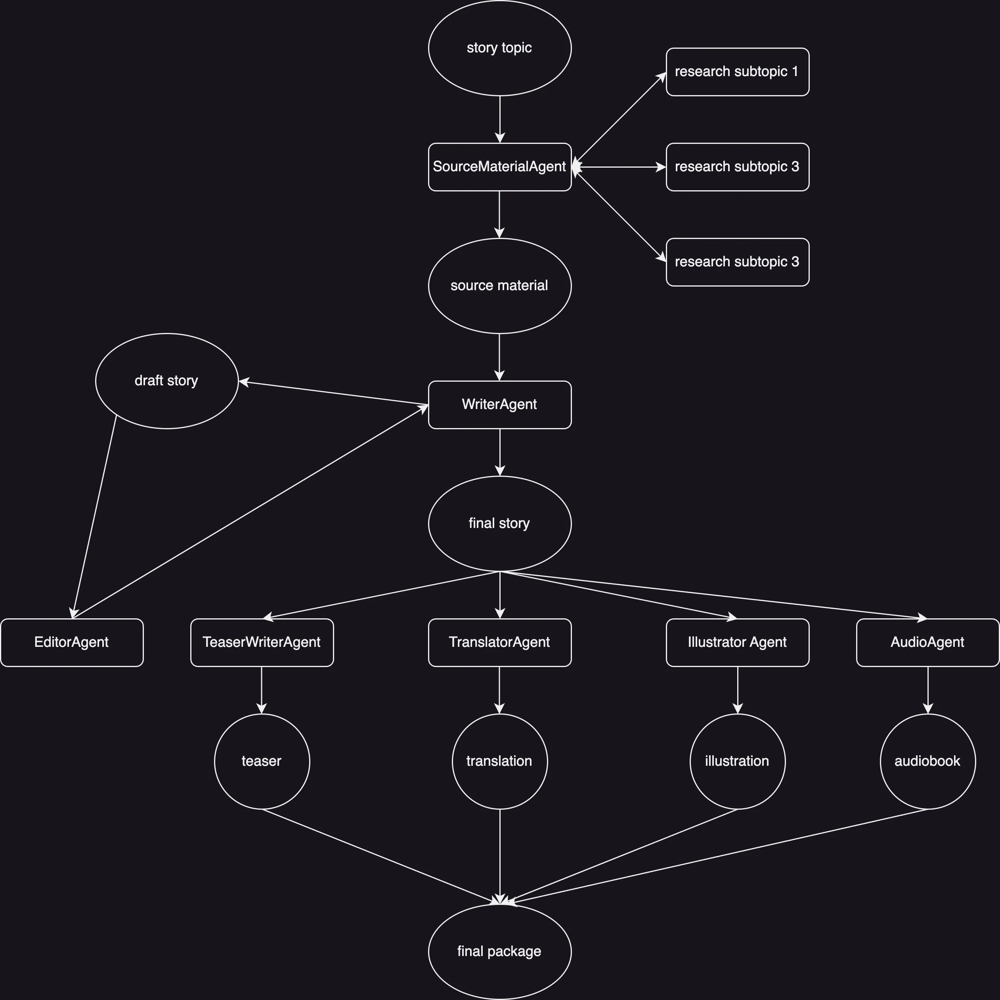

# Traverse Story 

https://traverse-stories.streamlit.app/

Traverse Story is an AI-powered story generation and publishing platform that transforms simple topics into complete story packages with illustrations, audio narrations, and translations.

## 🌟 Features

- **Story Generation**: Creates original sci-fi short stories from any given topic
- **Editorial Review**: Provides professional editorial feedback
- **Social Media Teaser**: Generates catchy 2-sentence teasers
- **Japanese Translation**: Translates stories into Japanese with cultural nuance
- **Illustration Generation**: Creates anime-style illustrations using DALL-E 3
- **Audio Narration**: Converts stories into professional audio narrations

## 🔧 Tech Stack

- **Streamlit**: Web interface
- **AgentPro**: Equip agents with tools to carry out tasks
- **LlamaIndex**: Workflow management
- **OpenAI**:
  - Story generation and refinement and translation.
  - DALL-E 3 for illustrations
  - Text-to-Speech for audio narration
- **Tavily**: Research and content gathering

## 📖 How It Works

1. **Research Phase**:
   - Gathers initial research on the topic
   - Identifies and researches three subtopics for deeper context

2. **Writing Phase**:
   - Generates initial story draft
   - Receives editorial feedback
   - Refines story based on feedback

3. **Production Phase**:
   - Creates social media teaser
   - Translates to Japanese
   - Generates illustration
   - Creates audio narration
  
 

## 🚀 Getting Started
Locally: clone the app on your machine. create a virtual env, for example with conda. then install the neccasary packages with
  ```bash
      pip install -r requirements.txt
  ```
after that, please create a .env file and put in API keys for Tavily, and OpenAI

finally, to run the app
  ```bash
      streamlit run app.py
  ```
Some sample artifacts are inside the publication folder.
