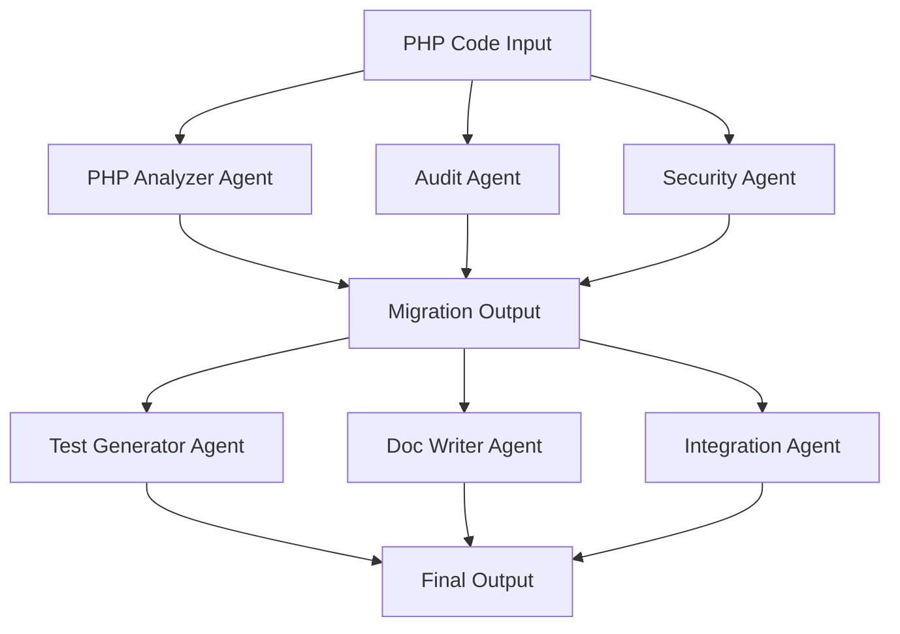

# PHP to Next.js Migration Multi-Agent System (Developed Using AgentPro Framework)

## 🎯 Project Overview

**This project** is a multi-agent AI system, built entirely on the AgentPro Framework, enabling **modular, autonomous agents to collaborate in migrating legacy PHP applications to modern Next.js 14 stacks.** Each agent is powered by Mistral's Codestral model and focuses on specific tasks like code conversion, security analysis, and documentation generation.


## 🔥 Key Features

- 🤖 **Multi-Agent Framework**: Modular agents specialized in code transformation, analysis, and generation
- 🔄 **Automatic Migration**: Converts PHP to production-ready Next.js 14 structure
- 🔐 **Security Insights**: AI-driven vulnerability scans
- 🧪 **Test Generator**: Auto-creates unit tests for frontend/backend code
- 📚 **Documentation Builder**: Generates complete `README.md` files
- 🗃️ **Integration Agent**: Reconstructs final file structure for deployment

## 📽️ Demo  
[Watch the demo on YouTube](https://youtu.be/4XC9NA6-KNI)

For a guided walkthrough of the code, watch [this video](https://youtu.be/libPqCGAQoE)

## 🌐 Try It Live on Hugging Face

Launch the app instantly from your browser:

👉 [**Try Our Multi-agent System Now**](https://huggingface.co/spaces/malekbouzayani/hackathon-traversaal-ai)


## 🏗️ System Architecture



## 👨‍👩‍👧‍👦 Agent Specializations

| Agent | Role |
|-------|------|
| **PHP Analyzer** | Converts PHP code into modern Next.js 14 |
| **Audit Agent** | Extracts structure, features, DB schema |
| **Security Agent** | Finds vulnerabilities in PHP/JS code |
| **Test Generator** | Generates unit tests |
| **Doc Writer** | Writes full `README.md` documentation |
| **Integration Agent** | Builds final file structure from AI-generated code |

## ⚡ Quick Start

### 1. Clone the Repository

```bash
git clone https://github.com/Hiba-Chaabnia/Traversaal-x-Optimized-AI-Hackathon.git
cd Traversaal-x-Optimized-AI-Hackathon
```

### 2. Install Dependencies

```bash
pip install -r requirements.txt
```

### 3. Configure Environment Variables

```bash
cp .env.example .env
# Then edit .env with your API keys
```

### 4. Launch the Migration UI

```bash
streamlit run app.py
```

### 5. Migrate Your PHP Project

- Upload a PHP project (ZIP or individual file)
- Click "Start Migration"
- Monitor real-time progress
- Download the fully converted Next.js 14 project

## 🗂️ Project Structure

```
agentpro/
├── agentpro/
│   ├── tools/
│   │   ├── php_migration_tool.py    # PHP to Next.js conversion
│   │   ├── php_audit_tool.py        # Code analysis
│   │   ├── security_tool.py         # Security checking
│   │   ├── test_generator_tool.py   # Test creation
│   │   └── ...
│   └── agent.py                     # Main agent controller
├── app.py                           # Streamlit interface
└── requirements.txt                 # Dependencies
```

## 🛠️ Technical Workflow

Our system uses a **phased pipeline**, orchestrated by intelligent agents to handle different aspects of the migration process:


1. **🔍 Analysis Phase**
   - Parse PHP codebase
   - Extract app structure and features
   - Perform static security analysis

2. **🔄 Migration Phase**
   - Transform PHP to Next.js 14
   - Generate API routes
   - Integrate database models

3. **✨ Enhancement Phase**
   - Auto-generate unit tests
   - Create documentation
   - Assemble folder structure

4. **📦 Output Phase**
   - Package project with complete structure
   - Configure environment files
   - Ready for deployment


## 📝 License

This project is licensed under the [Apache 2.0 License](./LICENSE.txt) – see the LICENSE file for details. 


## 📬 Contact  

For questions or feedback, contact me directly via:

<p align="left">
  <a href="https://linkedin.com/in/hiba-chaabnia" target="_blank">
    
  </a>
  
  <a href="mailto:hiba.chaabnia.pro@gmail.com">
    
  </a>
</p>

